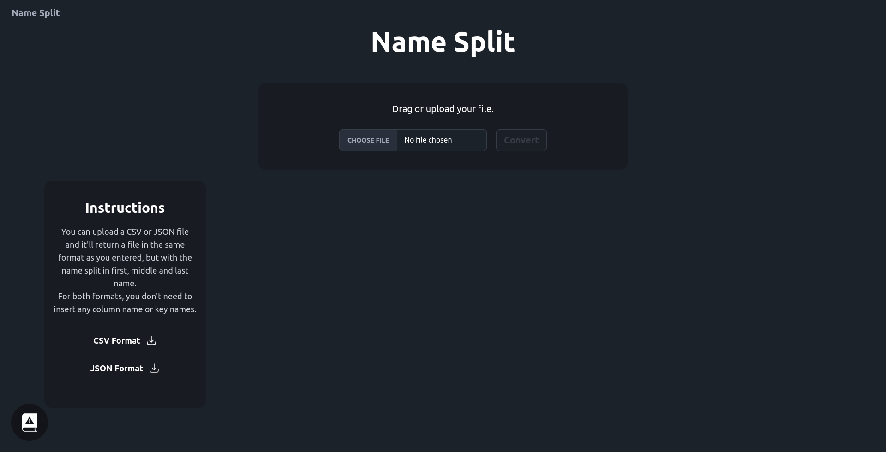

# Split Names Site

This is an Astro site to split names into first, middle and last name. It uses Astro, Tailwind (with DaisyUI) and React.



## 🚀 Quick start

```
npm install
npm run dev
```

To deploy, you'll need to [add an adapter](https://docs.astro.build/en/guides/server-side-rendering/#add-an-adapter).

## 🧞 Commands

All commands are run from the root of the project, from a terminal:

| Command                   | Action                                           |
|:--------------------------|:-------------------------------------------------|
| `npm install`             | Installs dependencies                            |
| `npm run dev`             | Starts local dev server at `localhost:4321`      |
| `npm run build`           | Build your production site to `./dist/`          |
| `npm run preview`         | Preview your build locally, before deploying     |
| `npm run astro ...`       | Run CLI commands like `astro add`, `astro check` |
| `npm run astro -- --help` | Get help using the Astro CLI                     |
